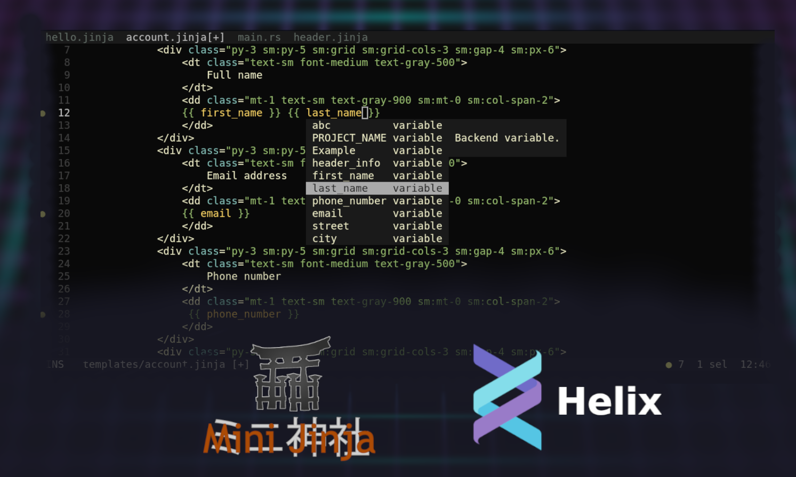
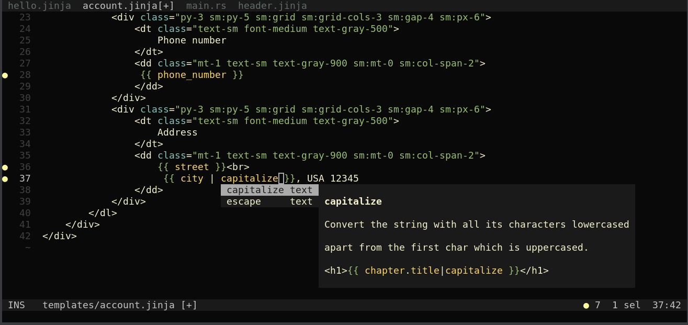
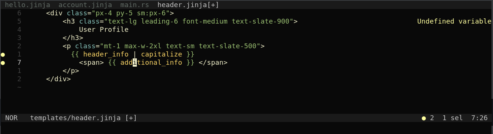
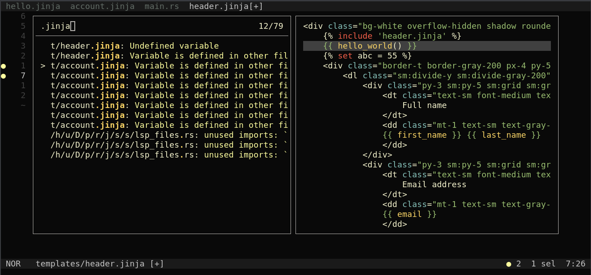
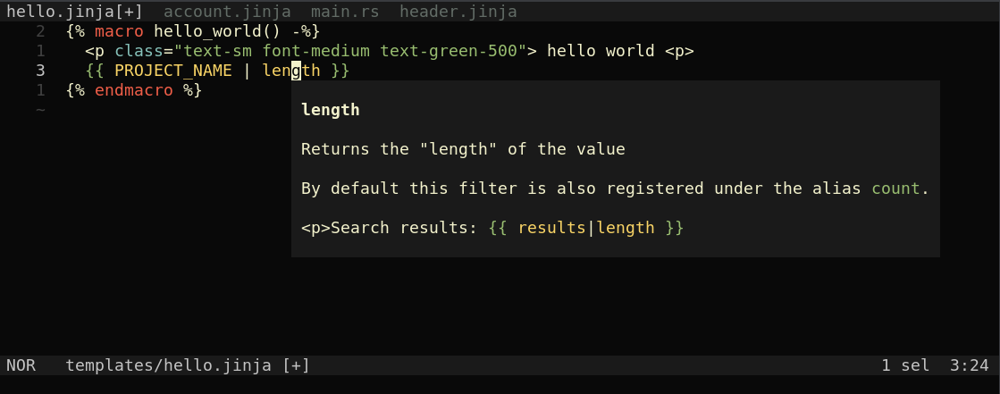
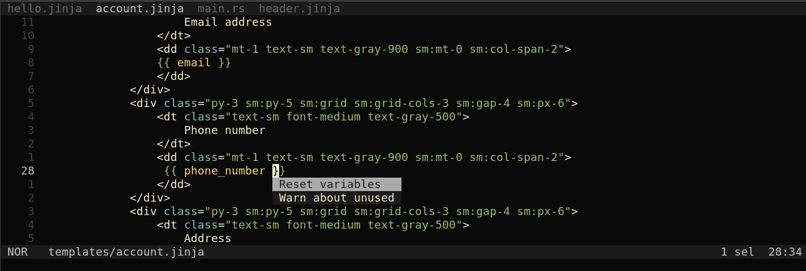

jinja-lsp enhances minijinja development experience by providing Helix/Nvim users with advanced features such as autocomplete, syntax highlighting, hover, goto definition, code actions and linting.

## Installation

```sh
cargo install jinja-lsp
```


## Features

### Autocomplete

Intelligent suggestions for variables in current template, as well as variables and filters defined on backend side.



### Linting

Highlights errors and potential bugs in your jinja templates.  





### Hover Preview

See the complete filter description by hovering over it.




### Code Actions

It's recommended to reset variables on server in case you rename/delete file.



### Goto Definition

Quickly jump to definition. Works for Rust identifiers as well. 

https://github.com/uros-5/jinja-lsp/assets/59397844/015e47b4-b6f6-47c0-8504-5ce79ebafb00

## Configuration

Language server configuration

```json
{ "templates": "./TEMPLATES_DIR", "backend": ["./BACKEND_DIR"], "lang": "rust"}
````

Helix configuration

```toml
[language-server.jinja-lsp]
command = "jinja-lsp"
config = { templates = "./templates", backend = ["./src"], lang = "rust"}
timeout = 5


[[language]]
name = "jinja"
language-servers = ["jinja-lsp"]
```

